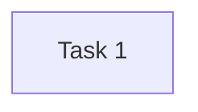
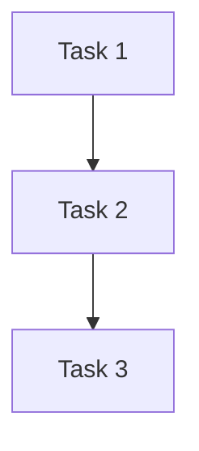
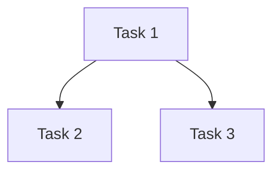
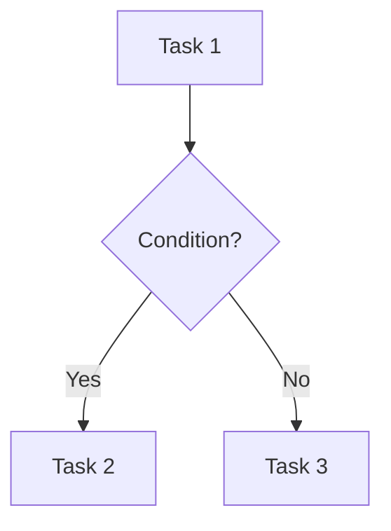

# Types of Chains

## Simple Chain
A simple chain consists of a single step or task.

**Diagram:**

**Use Cases:**
- Single-step data processing.
- Simple data retrieval tasks.

## Sequential Chain
A sequential chain consists of multiple steps executed one after another.

**Diagram:**

**Use Cases:**
- Data processing pipelines.
- Multi-step data transformation.

## Parallel Chain
A parallel chain consists of multiple steps executed simultaneously.

**Diagram:**

**Use Cases:**
- Concurrent data processing.
- Parallel data analysis.

## Conditional Chain
A conditional chain consists of steps executed based on certain conditions.

**Diagram:**

**Use Cases:**
- Decision-based data processing.
- Conditional data workflows.

